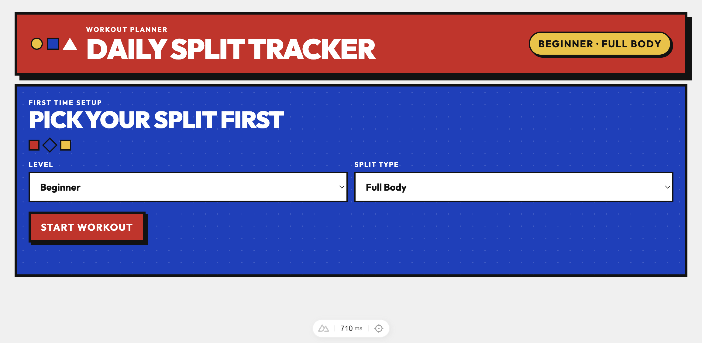
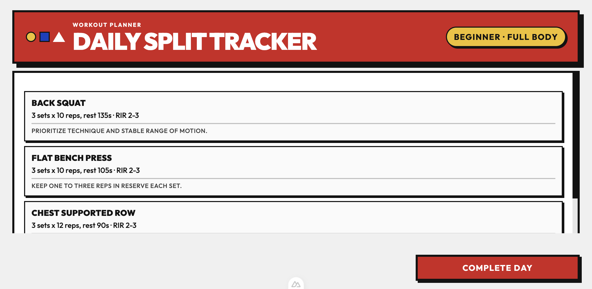
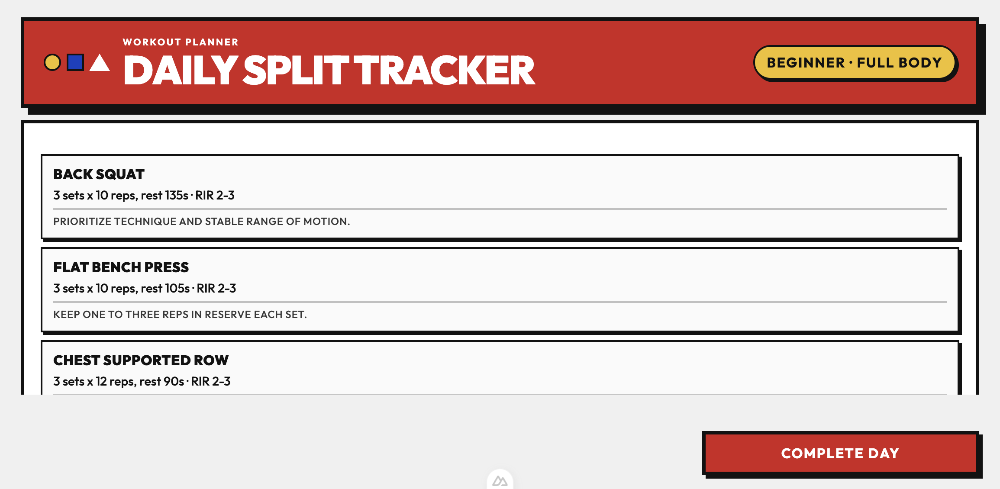

# Workout PWA

A Nuxt 4 Progressive Web App for day-by-day workout tracking with a 4-day repeating cycle.

## Features

- First-time setup flow for level and split selection.
- Level-based programming logic for Beginner, Intermediate, and Advanced users.
- 4-day fixed cycle that repeats after Day 4.
- Complete-day progression with confirmation prompt.
- Persistent local storage state for offline-style continuity.
- PWA install support with in-app install button when available.
- Static site generation ready (`npm run generate`).

## Screenshots

### Setup Screen



### Workout Screen (Desktop)



### Workout Screen (Mobile)



## Run Locally

```bash
npm install
npm run dev
```

Local app: `http://localhost:3000`

## Build

```bash
npm run build
```

## Generate Static Output

```bash
npm run generate
```

Generated output: `.output/public`

## Deploy

GitHub Pages workflow is configured to deploy on push to `master` via:

- `.github/workflows/deploy-pages.yml`
